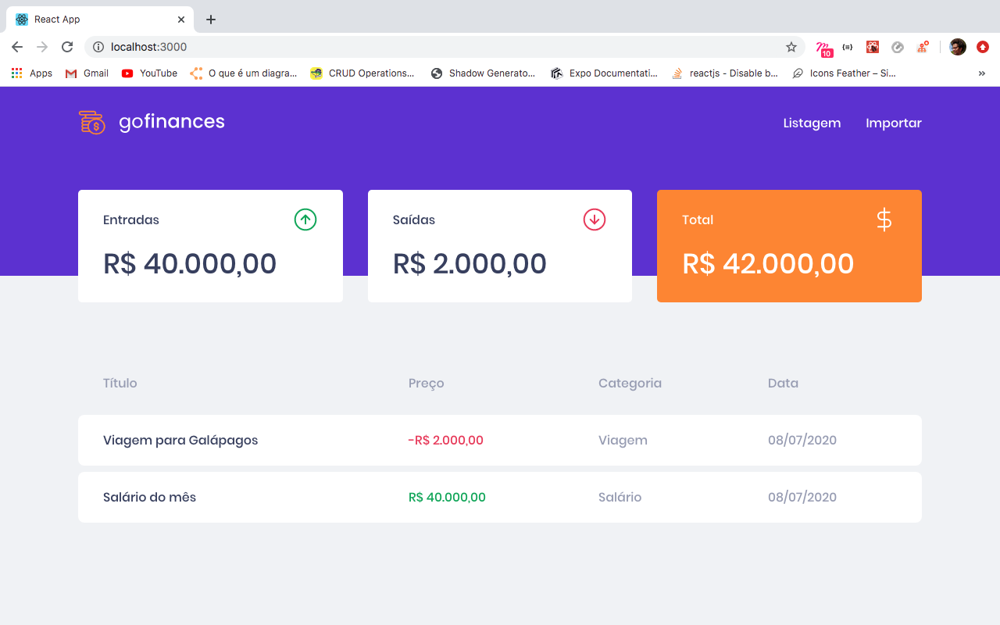
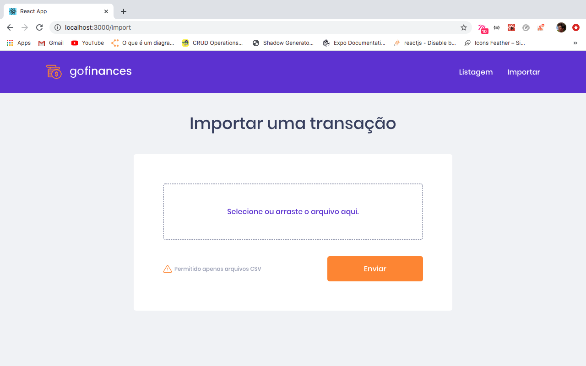
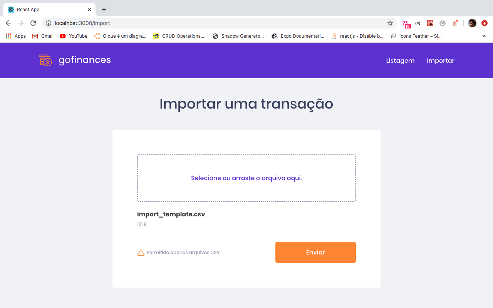

# 🚀 GoFinances Web

Desafio de continuação do desenvolvendo da aplicação de gestão de transações, a GoFinances propposta 
pela Bootcamp da Rpcketseat. Essa aplicação foi feita em React.js junto com TypeScript, 
utilizando rotas e envio de arquivos por formulário.

Essa aplicação se conecta ao backend do [Desafio 06]
(https://github.com/tialaR/Desafio-GoStack-06-Database-Upload), 
exibindo as transações criadas e permitindo a importação de um arquivo CSV para gerar novos registros no banco de dados.

